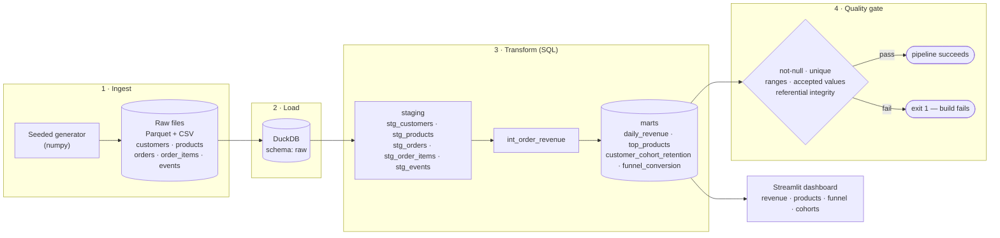

# CommercePipeline

A batteries-included e-commerce analytics pipeline that turns raw operational data into trustworthy business marts — with data-quality gates that fail the build when the numbers can't be trusted.

## The problem

Analytics dashboards are only as good as the data behind them. In most teams the path from raw operational tables to a "revenue by day" chart is a pile of ad-hoc notebooks and untested SQL: no lineage, no tests, and no gate that stops a broken extract from silently poisoning every downstream metric. The result is dashboards nobody trusts and incidents nobody catches until a number looks wrong in a meeting.

CommercePipeline is a compact, end-to-end reference for doing it properly — ingestion, a warehouse, layered SQL models, automated data-quality gates, orchestration, and a dashboard — that runs locally in about a second with zero paid services.

## What it does

It generates a realistic synthetic e-commerce dataset, loads it into a DuckDB warehouse, builds staged SQL models (staging → marts), enforces data-quality gates that **halt the pipeline on bad data**, and serves the marts through a Streamlit dashboard.



The four stages are composed by a dependency-free flow (`pipeline.flow`), exposed on a CLI (`python -m pipeline run`), wired as a Makefile DAG, and — optionally — as a Prefect flow (`pipeline.orchestrate`).

## Results / impact

A full run on the default seed (`make pipeline`) produces, in **~0.7s** end to end:

| Metric | Value |
| --- | --- |
| Raw rows generated | **103,839** across 5 tables (2,000 customers · 120 products · 12,000 orders · 30,120 order items · ~59,600 events) |
| Marts produced | **5** — `daily_revenue`, `top_products`, `customer_cohort_retention`, `funnel_conversion` (+ `int_order_revenue`) |
| Data-quality gates | **16 / 16 passing** (not-null, uniqueness, accepted ranges, accepted values, referential integrity, mart sanity) |
| Modelled revenue | ~$2.46M across 352 active days, ~35% view→purchase funnel conversion |
| Tests | **19 passing** in ~1.1s (`pytest -q`) |

Correctness is enforced, not assumed: tests assert exact aggregates on a known fixture, that the quality gate catches injected bad rows, and that two business invariants reconcile end to end — **funnel purchases == completed orders**, and **mart revenue == sum of completed line items**.

## Quickstart

```bash
# 1. install (lean: duckdb, pandas, pyarrow, streamlit, pytest)
pip install -r requirements.txt

# 2. run the whole pipeline: ingest -> load -> transform -> quality gate
make pipeline          # or: python -m pipeline run

# 3. run the tests
make test              # or: pytest -q

# 4. launch the dashboard (http://localhost:8501)
make dashboard         # or: streamlit run dashboard/app.py

# ...or do the pipeline + dashboard in one shot
make demo
```

Individual stages are addressable too: `python -m pipeline {ingest,load,transform,quality}`. Dataset size and seed are configurable via env vars, e.g. `CP_N_ORDERS=50000 CP_SEED=7 make pipeline`.

## Tech stack

- **Python 3.9+** — typed, dependency-light standard-library code
- **DuckDB** — in-process analytical warehouse (no server to run)
- **SQL** — layered staging → intermediate → mart models in plain `.sql` files
- **pandas / pyarrow** — synthetic data generation and Parquet I/O
- **Streamlit + Altair** — the analytics dashboard
- **pytest** — fixture-based transform tests + data-quality gate tests
- **Make** — the orchestration DAG (optional **Prefect** flow included)
- **Docker / docker-compose** and **GitHub Actions** — reproducible build + CI

## Deploy

**Container (one command):**

```bash
docker compose up --build      # builds the warehouse, serves the dashboard on :8501
```

The image runs the full pipeline at build and start time, then serves the Streamlit app with a health check on `/_stcore/health`.

**Streamlit Community Cloud:** push this repo to GitHub, create an app pointing at `dashboard/app.py`, and add `requirements.txt` as the dependency file. The app builds the warehouse on first load if one isn't present, so no external storage is required. (For a heavier dataset, run the pipeline in a build step and commit the `data/warehouse/commerce.duckdb` artifact.)

**CI:** `.github/workflows/ci.yml` runs the pipeline and the test suite on Python 3.9 / 3.11 / 3.12 on every push and PR, and uploads the generated warehouse as a build artifact.

## Dashboard

The Streamlit app reads the marts the quality gate signed off on and presents
them as a polished, data-forward BI product — a branded header, a bento-style
KPI grid with **pipeline-health proof cards** (rows processed, marts built,
data-quality gates passing) surfaced alongside the business KPIs, monospace
numerals for every figure, styled Altair charts in one cohesive teal palette,
and a lineage + per-check quality-gate view of the ingest → load → transform →
quality-gate flow. The theme (a confident teal accent on slate neutrals) lives
in `.streamlit/config.toml`.

```bash
make dashboard          # or: streamlit run dashboard/app.py  →  http://localhost:8501
```

<!-- Screenshots: revenue trend · top products · conversion funnel · cohort retention heatmap -->
_Add dashboard screenshots here (revenue trend, top products, conversion funnel, cohort retention heatmap)._
